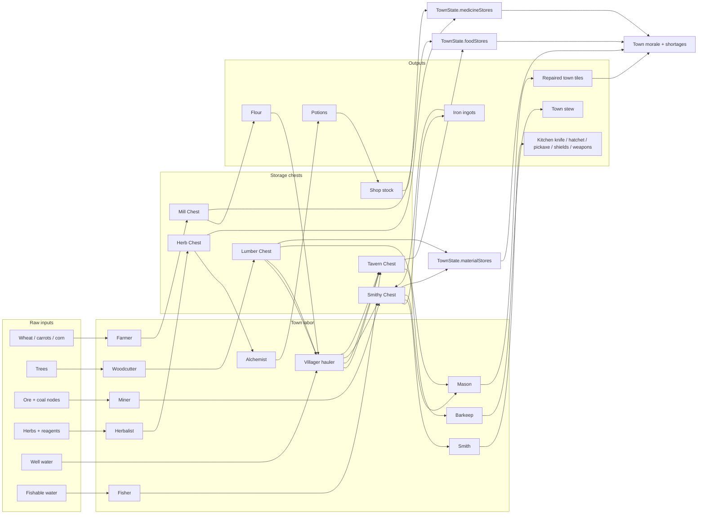

# Town Economy

Classical view: raw inputs enter the town through labor and harvest nodes, move
through storage chests, then become intermediate goods, tools, medicine, meals,
and town-state signals.

Current production rules:

- Mill: `food_wheat` becomes `food_flour`.
- Furnace: `ore_iron` plus `ore_coal` becomes `material_iron`.
- Smithy: `material_iron` plus `material_lumber` becomes town tools and gear.
- Tavern: `food_flour` or `food_raw_fish` plus `fuel_firewood`, with reusable
  `water_bucket` and `tool_kitchen_knife`, becomes `food_stew`.
- Alchemist: herb chest reagents can become shop potion stock.

Observed bottlenecks to watch:

- Goods only produce when inputs land in the correct chest.
- Reusable kitchen tools and water buckets gate stew production.
- Lumber is split between smithing, tavern fuel, and repairs.
- The town keeps a visible prepared-meal reserve, so stew should not drain to
  zero just because townsfolk eat.

Future passes:

- Add more advanced smithing recipes.
- Give Town Stew its own food effect while keeping the item icon.
- Add a trinket gear slot.
